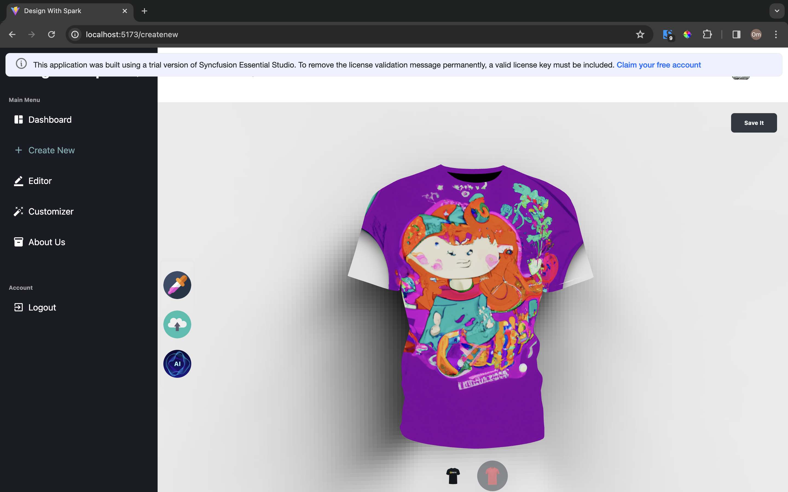
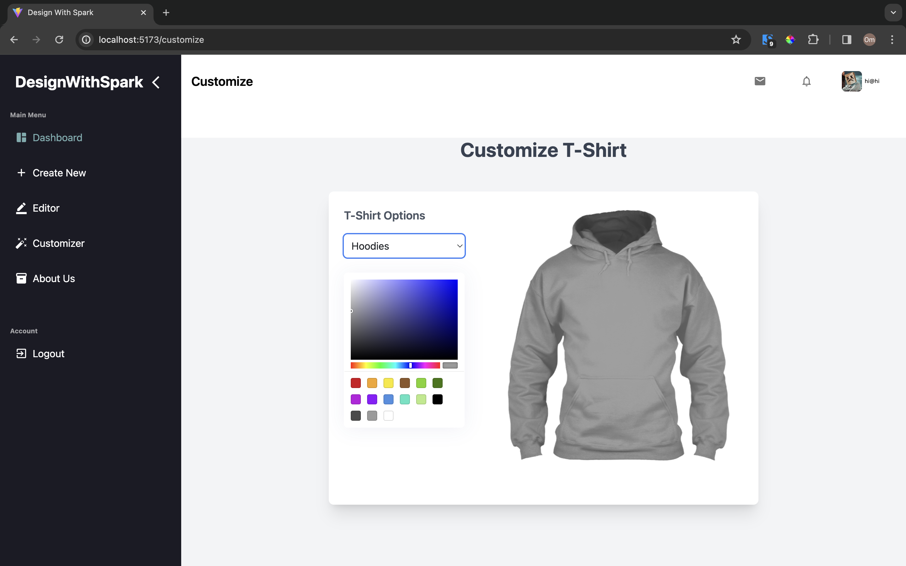
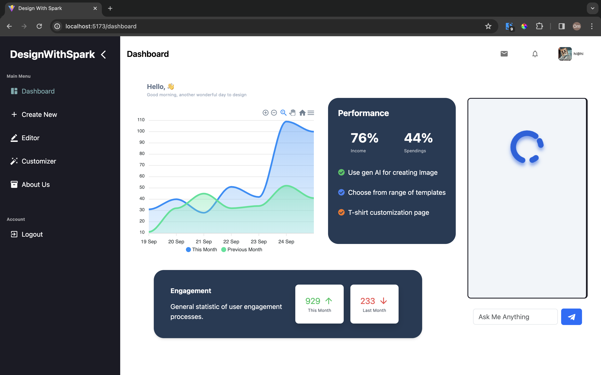

# Design-with-Spark ✨

Welcome to **Design-with-Spark**, a cutting-edge web application that unleashes your creativity, allowing you to design stunning T-shirts with the help of generative AI image generation. Dive into the world of fashion and personalize not just T-shirts but also Shirts, Hoodies, and Tank Tops with your unique touch. Featuring a dynamic dashboard, an intelligent AI chat-bot for assistance, and groundbreaking text-to-image technology, your design journey promises to be seamless and innovative.

 

## Features 🚀

- **AI-Powered Design Tools:** Leverage generative AI to create unique and beautiful T-shirt designs.
- **3D Model Customization:** Get a realistic feel of your custom designs with our 3D model viewer.
- **Versatile Customization:** Add logos, texts, and choose from a wide range of colors to make your design stand out.
- **Responsive Dashboard:** Track your creations and insights with our user-friendly dashboard, equipped with graphs and statistical data.
- **AI Chat-Bot:** Stuck somewhere? Our AI chat-bot is here to assist you with any queries.
- **Text-to-Image Generation:** Directly generate images onto T-shirts using our innovative text-to-image feature.
- **Multi-Product Support:** Unleash your creativity on T-shirts, Shirts, Hoodies, and Tank Tops.
- **Responsive Design:** Enjoy a seamless experience across all your devices.
- **Authentication System:** Secure Sign Up and Log In functionalities.
- **Cloud-Integrated Database:** Powered by MongoDB Cloud for robust data management.
 


## Tech Stack 💻

- **Frontend:** ReactJS with Tailwind CSS for a sleek, responsive UI.
- **Backend:** NodeJS and Express JS for efficient server-side management.
- **Database:** MongoDB Cloud for scalable and secure data storage.
- **Others:** .gitignore for clean repository maintenance.

 

## Getting Started 🌟

To get your local copy up and running, follow these simple steps:

### Prerequisites

Ensure you have `npm` installed:

```bash
npm install npm@latest -g

```

Clone the repository:
bash
Copy code
git clone https://github.com/saksham-gera/Design-with-Spark.git
Install NPM packages for both client and server directories:

# In the client directory
```bash
npm install
```
# In the server directory
```bash
npm install
```
Set up your .env file in both directories with the required API keys and database URI.

Run the application:

```bash
# In the client directory
npm start

# In the server directory

npm run dev
```


# License 📄
Distributed under the MIT License. See LICENSE for more information.


